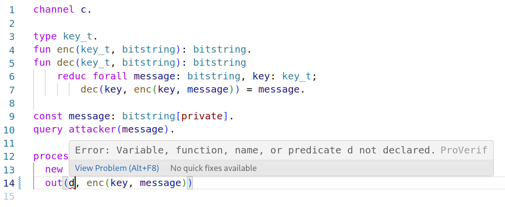

# VSCode ProVerif Language Service

A very simple (stupid) ProVerif language service. It will show you syntax errors in VSCode:



Use in combination with https://github.com/georgio/proverif-vscode to get syntax highlighting.

Ensure you have `ProVerif` installed, and it is in your `$PATH` (i.e. when entering `proverif` in your console, the tool executes).

## Functionality

Under the hood, this language server simply invokes `proverif` over the currently edited file. 

This has the following limitations:
- Only the first syntax error is shown (as only the first is output by `proverif`).
- `proverif` is re-run on every keystroke.
- `proverif` will attempt to proof the lemmas if no syntax error is found. The extension attempts to prevent high CPU usage by terminating `proverif` execution after one second (as then likely no syntax error exists; and the extension does not care about the proofs).

## Develop

Contributions welcome! Be aware of the automated tests (and keep them running).

Heabily inspired by the example published by Microsoft at https://code.visualstudio.com/api/language-extensions/language-server-extension-guide

Run & test locally:

- Run `npm install` in this folder. This installs all necessary npm modules in both the client and server folder
- Open VS Code on this folder.
- Press Ctrl+Shift+B to start compiling the client and server in [watch mode](https://code.visualstudio.com/docs/editor/tasks#:~:text=The%20first%20entry%20executes,the%20HelloWorld.js%20file.).
- Switch to the Run and Debug View in the Sidebar (Ctrl+Shift+D).
- Select `Launch Client` from the drop down (if it is not already).
- Press ▷ to run the launch config (F5).
- In the [Extension Development Host](https://code.visualstudio.com/api/get-started/your-first-extension#:~:text=Then%2C%20inside%20the%20editor%2C%20press%20F5.%20This%20will%20compile%20and%20run%20the%20extension%20in%20a%20new%20Extension%20Development%20Host%20window.) instance of VSCode, open a document with a ProVerif extension.
  - Enter ProVerif code, and observe how syntax errors are highlighted.


## Publish

Make sure you have https://github.com/microsoft/vscode-vsce installed.

Then publish with
```
vsce package
vcse publish
```

This package is not yet in the VSCode marketplace. It will be published as soon as some experience has been collected.
